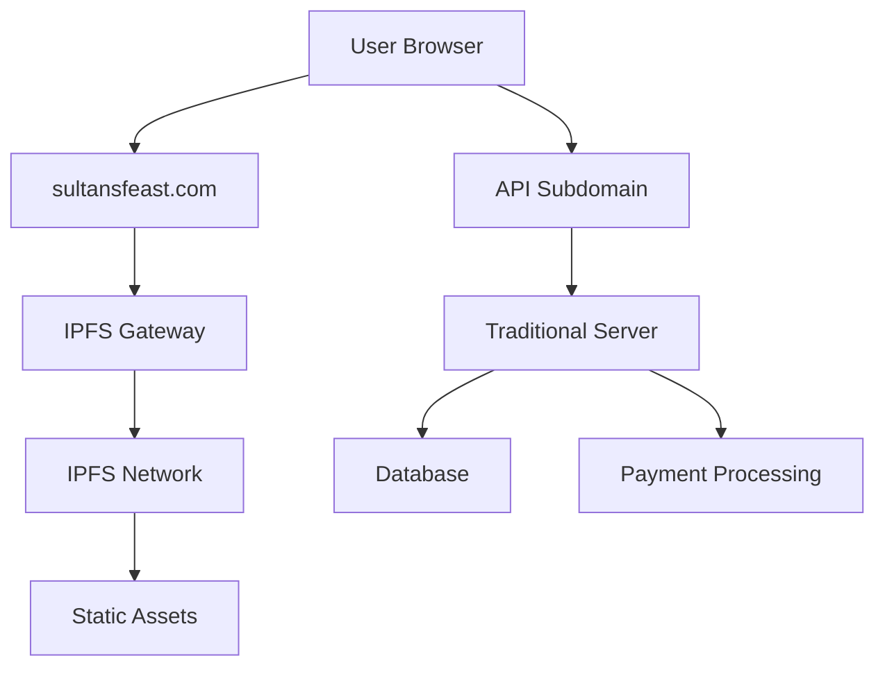

# 🚀 Sultan's Feast - Web 3.0 Integration Guide

## Executive Summary

This document outlines three strategic Web 3.0 integrations that can transform Sultan's Feast from a traditional restaurant website into a cutting-edge, blockchain-enabled dining experience. These implementations will position the brand at the forefront of hospitality technology while creating new revenue streams and enhancing customer loyalty.

---

## 🎨 Part 1: Web 3.0 Integration Concepts

### 1. NFT-Based Loyalty Program: "Sultan's VIP Collection"

#### **Concept Overview**
Create an exclusive collection of 1,000 "Sultan's Feast VIP" NFTs, each representing a unique membership tier in our premium loyalty program. These digital assets will grant holders exclusive privileges and create a sense of community among our most valued customers.

#### **NFT Collection Structure**
- **Platinum Sultan (100 NFTs)**: Ultra-rare tier with maximum benefits
- **Gold Sultan (300 NFTs)**: Premium tier with substantial perks
- **Silver Sultan (600 NFTs)**: Entry-level VIP tier with exclusive access

#### **Exclusive Benefits for NFT Holders**
- **Priority Reservations**: Skip waitlists and book premium time slots
- **Complimentary Experiences**: Free appetizer or dessert with every visit
- **Special Events**: Exclusive invitations to chef's table experiences and wine tastings
- **Seasonal Perks**: Early access to new menu items and holiday specials
- **Digital Collectibles**: Quarterly airdrops of recipe NFTs and behind-the-scenes content
- **Metaverse Access**: Virtual restaurant experiences and cooking classes

#### **Revenue & Marketing Benefits**
- **Initial Revenue**: Generate $50,000-$200,000 from initial NFT sales
- **Secondary Market**: Earn 5-10% royalties on all resales
- **Brand Prestige**: Position Sultan's Feast as an innovative, tech-forward establishment
- **Community Building**: Create a loyal customer base with shared digital ownership
- **Marketing Buzz**: Generate social media attention and press coverage

#### **Technical Implementation**

**Smart Contract Development:**
```solidity
// Simplified example structure
contract SultansFeastVIP {
    mapping(uint256 => string) public tokenTiers; // Platinum, Gold, Silver
    mapping(address => bool) public hasActiveNFT;
    
    function checkMembership(address user) public view returns (string memory) {
        // Logic to determine user's VIP tier
    }
}
```

**Website Integration Requirements:**
- **Blockchain**: Deploy on Polygon (low gas fees) or Ethereum mainnet
- **Library**: Integrate ethers.js or web3.js for wallet interactions
- **Backend**: Node.js service to verify NFT ownership
- **Database**: Store NFT metadata and customer benefits mapping
- **Frontend**: React components for wallet connection and membership display

**User Journey:**
1. Customer visits Sultan's Feast website
2. Connects MetaMask or compatible wallet
3. Website automatically detects NFT ownership
4. VIP dashboard displays available benefits
5. Reservation system shows priority booking options
6. Point-of-sale system applies automatic discounts

---

### 2. Cryptocurrency Payment Integration

#### **Concept Overview**
Enable customers to pay for reservations, online orders, and in-restaurant dining using popular cryptocurrencies including Bitcoin, Ethereum, and stablecoins like USDC and USDT.

#### **Supported Payment Methods**
- **Primary Cryptocurrencies**: Bitcoin (BTC), Ethereum (ETH)
- **Stablecoins**: USDC, USDT, DAI (for price stability)
- **Layer 2 Solutions**: Polygon MATIC, Arbitrum ETH (for lower fees)
- **Alternative Networks**: Solana SOL, Binance Smart Chain BNB

#### **Implementation Scenarios**

**Scenario A: Online Reservations & Orders**
- Customer selects cryptocurrency payment at checkout
- Smart contract escrow holds payment until service completion
- Automatic release upon confirmed reservation fulfillment
- Real-time price conversion with minimal slippage protection

**Scenario B: In-Restaurant Payments**
- QR code generation for instant crypto payments
- Point-of-sale integration with live exchange rates
- Receipt generation with transaction hash for transparency
- Optional tipping in cryptocurrency

#### **Business Benefits**
- **Market Expansion**: Attract crypto-native customers and tourists
- **Lower Fees**: Reduce credit card processing costs (2-3% vs 0.5-1%)
- **International Reach**: Accept payments from global customers without currency conversion
- **Marketing Differentiation**: First restaurant in the area to accept crypto
- **Future-Proofing**: Early adoption of inevitable payment evolution

#### **Technical Architecture**

**Payment Gateway Integration:**
```javascript
// Coinbase Commerce integration example
const commerce = require('coinbase-commerce-node');

async function createCryptoPayment(orderDetails) {
    const charge = await commerce.charges.create({
        name: 'Sultan\'s Feast Reservation',
        description: `Table for ${orderDetails.guests} - ${orderDetails.date}`,
        local_price: {
            amount: orderDetails.total,
            currency: 'USD'
        },
        pricing_type: 'fixed_price',
        metadata: {
            restaurantId: 'sultans-feast',
            reservationId: orderDetails.id
        }
    });
    return charge;
}
```

**Direct Wallet Integration:**
```javascript
// Direct MetaMask integration for instant payments
async function processDirectPayment(amount, recipientAddress) {
    const provider = new ethers.providers.Web3Provider(window.ethereum);
    const signer = provider.getSigner();
    
    const transaction = {
        to: recipientAddress,
        value: ethers.utils.parseEther(amount.toString()),
        gasLimit: 21000
    };
    
    const tx = await signer.sendTransaction(transaction);
    return await tx.wait();
}
```

**Security Considerations:**
- **Multi-signature wallets** for business fund management
- **Cold storage** for long-term cryptocurrency holdings
- **Real-time monitoring** for payment confirmations
- **Compliance integration** with tax reporting systems

---

### 3. Decentralized Hosting with IPFS (InterPlanetary File System)

#### **Concept Overview**
Migrate Sultan's Feast website from traditional web hosting to a decentralized architecture using IPFS, ensuring censorship resistance, improved performance, and reduced infrastructure costs.

#### **IPFS Implementation Benefits**

**Technical Advantages:**
- **Censorship Resistance**: Website remains accessible even if traditional servers fail
- **Global Distribution**: Content cached worldwide for faster load times
- **Version Control**: Immutable snapshots of website updates
- **Bandwidth Efficiency**: Peer-to-peer sharing reduces server load
- **Cost Reduction**: Eliminate traditional hosting fees after initial setup

**Business Advantages:**
- **Brand Innovation**: Demonstrate technological leadership in hospitality
- **Reliability**: 99.9%+ uptime through distributed architecture
- **International Access**: Reach customers in regions with internet restrictions
- **Future-Proof Infrastructure**: Align with Web3 ecosystem development

#### **Implementation Strategy**

**Phase 1: Static Asset Migration**
```bash
# Upload website assets to IPFS
ipfs add -r /path/to/sultansfeast-website
# Returns: QmXXXXXX... (IPFS hash)

# Access via public gateways
https://ipfs.io/ipfs/QmXXXXXX
https://gateway.pinata.cloud/ipfs/QmXXXXXX
```

**Phase 2: Domain Integration**
```dns
# DNS TXT record for IPFS resolution
_dnslink.sultansfeast.com TXT "dnslink=/ipfs/QmXXXXXX"

# ENS domain setup (Ethereum Name Service)
sultansfeast.eth → QmXXXXXX
```

**Phase 3: Automated Deployment**
```javascript
// Automated IPFS deployment with GitHub Actions
const { create } = require('ipfs-http-client');
const ipfs = create({ host: 'ipfs.infura.io', port: 5001, protocol: 'https' });

async function deployToIPFS(buildDirectory) {
    const result = await ipfs.addAll(globSource(buildDirectory, { recursive: true }));
    const rootHash = result[result.length - 1].cid.toString();
    
    // Update DNS records automatically
    await updateDNSLink(rootHash);
    
    // Pin to multiple IPFS nodes for redundancy
    await pinToMultipleNodes(rootHash);
    
    return rootHash;
}
```

**Content Delivery Strategy:**
- **Primary Access**: Custom domain with IPFS gateway
- **Backup Gateways**: Multiple public IPFS gateways for redundancy
- **CDN Integration**: Combine IPFS with traditional CDN for optimal performance
- **Mobile Optimization**: Progressive Web App (PWA) with IPFS integration

**Hybrid Architecture:**


---

## 🎯 Integration Roadmap & Timeline

### **Phase 1: Foundation (Months 1-2)**
- Implement wallet connection functionality
- Set up basic smart contract infrastructure
- Begin IPFS migration for static assets

### **Phase 2: Core Features (Months 3-4)**
- Launch NFT loyalty program with limited collection
- Integrate cryptocurrency payment options
- Complete IPFS hosting transition

### **Phase 3: Advanced Features (Months 5-6)**
- Implement advanced NFT utilities and benefits
- Add DeFi integrations (yield farming for loyal customers)
- Launch marketing campaign highlighting Web3 features

### **Phase 4: Community Building (Months 7-12)**
- Expand NFT collection with seasonal drops
- Create token-gated experiences and events
- Develop partnerships with other Web3 restaurants

---

## 💰 Investment & ROI Analysis

### **Initial Investment Required:**
- **Smart Contract Development**: $15,000 - $25,000
- **Frontend Integration**: $10,000 - $15,000
- **IPFS Infrastructure**: $2,000 - $5,000
- **Security Audits**: $5,000 - $10,000
- **Marketing & Launch**: $10,000 - $20,000

**Total Investment**: $42,000 - $75,000

### **Revenue Projections (Year 1):**
- **NFT Sales**: $75,000 - $150,000
- **Payment Processing Savings**: $5,000 - $10,000
- **Hosting Cost Reduction**: $2,000 - $5,000
- **Marketing Value**: $20,000 - $50,000 (equivalent advertising value)

**Projected ROI**: 140% - 220% in first year

---

## 🔧 Technical Considerations

### **Development Requirements:**
- **Blockchain Expertise**: Solidity smart contract development
- **Frontend Integration**: React.js with Web3 libraries
- **Backend Services**: Node.js with blockchain integration
- **Security**: Smart contract auditing and penetration testing

### **Infrastructure Needs:**
- **IPFS Pinning Service**: Pinata or Infura for reliable hosting
- **Blockchain Node Access**: Infura, Alchemy, or self-hosted nodes
- **Monitoring Tools**: Blockchain transaction monitoring and analytics

### **Regulatory Compliance:**
- **Payment Regulations**: Comply with local cryptocurrency payment laws
- **NFT Securities**: Ensure NFTs qualify as utility tokens, not securities
- **Tax Reporting**: Implement systems for cryptocurrency transaction reporting

---

## 🌟 Conclusion

The integration of Web 3.0 technologies positions Sultan's Feast as a pioneer in the hospitality industry, creating unique value propositions that traditional restaurants cannot match. By implementing NFT loyalty programs, cryptocurrency payments, and decentralized hosting, the restaurant will attract tech-savvy customers, generate new revenue streams, and build a future-ready digital infrastructure.

This comprehensive approach ensures Sultan's Feast remains competitive in an increasingly digital world while maintaining its core identity as a premium Turkish dining experience. The combination of traditional hospitality excellence with cutting-edge technology creates a truly unique market position that will drive long-term growth and customer loyalty.

---

*Next Step: Implement the wallet connection functionality demonstrated in the accompanying HTML example to begin the Web3 integration journey.*